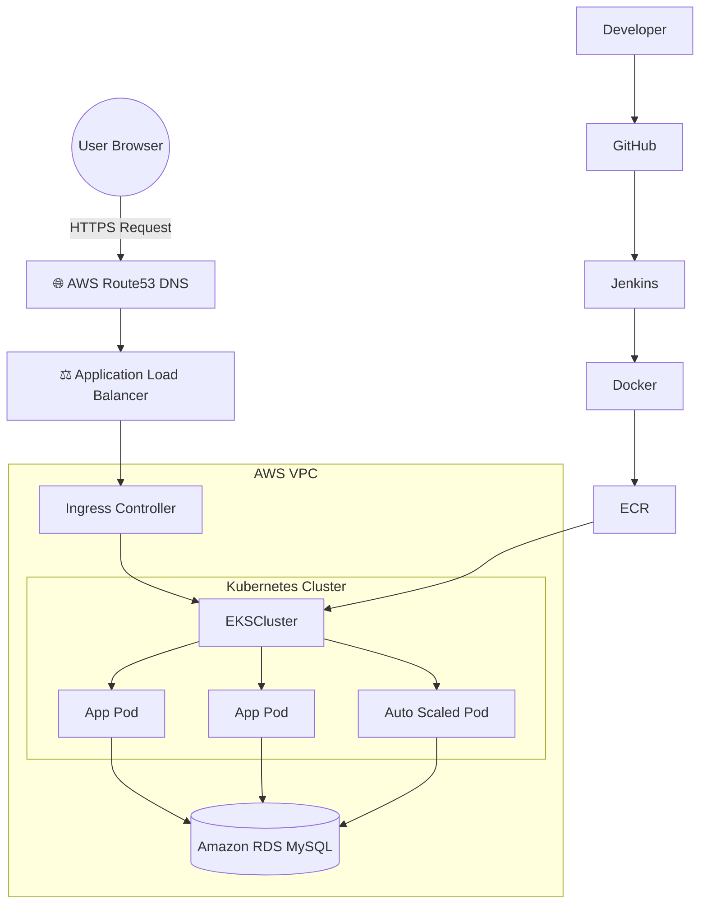
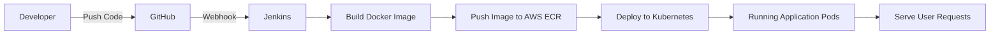
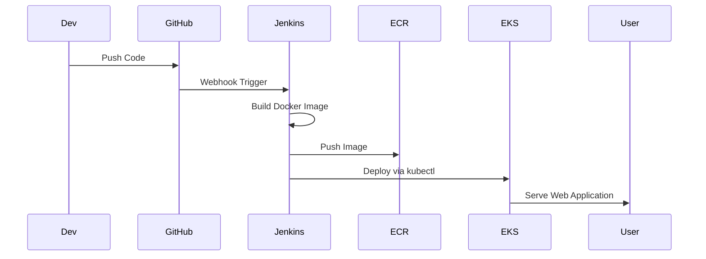

# 💎 THE LW LABS Gem Reporting System: Enterprise AWS Migration 🚀


---

# 📌 Project Overview

**THE LW LABS Gem Reporting System** demonstrates a **production-grade DevOps migration** of a traditional **PHP + MySQL application** from shared hosting to a **modern cloud-native architecture on AWS**.

The system uses:

- Infrastructure as Code with **Terraform**
- Containerization with **Docker**
- Container orchestration with **Kubernetes (EKS)**
- Continuous Integration & Deployment using **Jenkins**
- Managed database via **Amazon RDS**
- Container registry using **Amazon ECR**

The application is deployed in **AWS Mumbai Region (`ap-south-1`)** to ensure **low latency for Indian users**.

---

# 🏗️ Enterprise Architecture Diagram



---

# ⚙️ CI/CD Pipeline Flow



---

# 📊 Deployment Lifecycle



---

# 🗂️ Project Directory Structure

```
lwlabs-aws-eks-migration/

├── .gitignore
├── README.md
├── Dockerfile
├── Jenkinsfile

├── infrastructure/
│   └── main.tf

├── k8s/
│   └── deployment.yaml

└── src/
    ├── index.html
    ├── make.html
    ├── get_report.php
    └── save_report.php
```

---

# 🧰 Technology Stack

| Layer | Technology |
|------|------------|
Frontend | HTML / CSS / JS |
Backend | PHP |
Database | MySQL |
Containers | Docker |
Orchestration | Kubernetes |
CI/CD | Jenkins |
Cloud | AWS |
IaC | Terraform |

---

# 🛠️ Prerequisites

Install the following tools:

```
Terraform >= 1.5
AWS CLI
kubectl
Docker
Jenkins Server
```

Configure AWS CLI:

```
aws configure
```

---

# 🚀 Step-by-Step Deployment Guide

---

# 1️⃣ Provision Infrastructure with Terraform

Navigate to infrastructure directory:

```
cd infrastructure
```

Initialize Terraform:

```
terraform init
```

Check infrastructure plan:

```
terraform plan
```

Deploy resources:

```
terraform apply --auto-approve
```

Terraform will create:

- VPC
- Public & Private Subnets
- Amazon EKS Cluster
- Amazon ECR Repository
- Amazon RDS MySQL

Save output values:

```
ECR_URL
RDS_ENDPOINT
EKS_CLUSTER_NAME
```

---

# 2️⃣ Connect to the Kubernetes Cluster

```
aws eks update-kubeconfig \
--region ap-south-1 \
--name lwlabs-eks-cluster
```

Verify cluster nodes:

```
kubectl get nodes
```

---

# 3️⃣ Initialize Database

Run temporary MySQL pod:

```
kubectl run mysql-client \
--image=mysql:8.0 \
-i --rm --restart=Never \
-- mysql -h <RDS_ENDPOINT> -u dbadmin -p
```

Create database table:

```
USE lwlabs_report;

CREATE TABLE reports (

reportNo VARCHAR(50) PRIMARY KEY,
weight VARCHAR(50),
species VARCHAR(100),
variety VARCHAR(100),
cut VARCHAR(100),
dimensions VARCHAR(100),
color VARCHAR(100),
clarity VARCHAR(50),
microscopic TEXT,
gemImage LONGTEXT,
reportImage LONGTEXT,
reportPdf LONGTEXT,
created_at TIMESTAMP DEFAULT CURRENT_TIMESTAMP
);
```

---

# 4️⃣ Configure Kubernetes Secrets

Generate Base64 encoded values:

```
echo -n "YOUR_RDS_ENDPOINT" | base64
echo -n "dbadmin" | base64
echo -n "YOUR_PASSWORD" | base64
echo -n "lwlabs_report" | base64
```

Update:

```
k8s/deployment.yaml
```

Replace placeholder values with the generated Base64 strings.

---

# 5️⃣ Configure Jenkins CI/CD Pipeline

In Jenkins dashboard:

```
New Item → Pipeline
```

Configure pipeline:

```
Pipeline Script from SCM
```

Repository URL:

```
https://github.com/your-repo/lwlabs-aws-eks-migration
```

Script path:

```
Jenkinsfile
```

Click **Build Now**.

---

# 🔁 Jenkins Pipeline Stages

Pipeline automatically performs:

```
1. Pull Source Code from GitHub
2. Build Docker Image
3. Push Image to AWS ECR
4. Deploy Kubernetes Manifests
5. Perform Rolling Update
```

---

# 📡 Verify Deployment

Check pods:

```
kubectl get pods
```

Check autoscaler:

```
kubectl get hpa
```

Get service URL:

```
kubectl get svc lwlabs-service
```

Example output:

```
EXTERNAL-IP: a1b2c3d4.ap-south-1.elb.amazonaws.com
```

Open in browser.

---

# 📈 Auto Scaling Configuration

## Kubernetes Pod Auto Scaling

```
CPU Threshold : 70%
Min Pods : 2
Max Pods : 20
```

Using:

```
Horizontal Pod Autoscaler (HPA)
```

---

## AWS Node Auto Scaling

```
Instance Type : t3.medium
Min Nodes : 2
Max Nodes : 5
```

Using:

```
EKS Managed Node Group
```

---

# 🔐 Security Architecture

Security best practices implemented:

- Private database subnets
- Kubernetes secrets for credentials
- IAM roles for Jenkins and EKS
- Secure HTTPS load balancing
- No credentials stored in GitHub

---

# 📊 Monitoring & Metrics

Monitoring tools used:

- Kubernetes Metrics Server
- Horizontal Pod Autoscaler
- AWS CloudWatch

---

# 🎯 DevOps Features Demonstrated

✔ Infrastructure as Code (Terraform)  
✔ Docker Containerization  
✔ Kubernetes Orchestration  
✔ CI/CD Pipeline (Jenkins)  
✔ AWS Cloud Architecture  
✔ Auto Scaling Infrastructure  
✔ Secure Secrets Management  

---

# 📜 License

MIT License

---

# 👨‍💻 Author

**Lakshay Walia**

DevOps | Cloud | Infrastructure Automation

---

# ⭐ Support

If you like this project:

⭐ Star the repository  
🍴 Fork the repository  
🚀 Deploy your own AWS infrastructure
